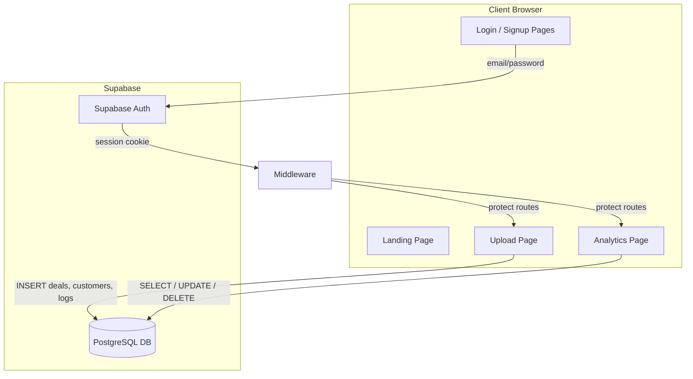

# Migrate CloseBoostAI from Local Storage to Supabase Auth + Database

## Current Problem

All data (deals, customers, logs, tasks) is stored in the browser via `localStorage` and `sessionStorage`. This means data is lost on browser clear, can't sync across devices, and there are no user accounts.

**Storage touchpoints to replace:**

- [app/upload/page.tsx](app/upload/page.tsx) lines 195-199, 271-274 -- `sessionStorage.setItem()` for deals, customers, logs after CSV parsing
- [app/analytics/page.tsx](app/analytics/page.tsx) lines 63-85 -- `localStorage.getItem()` to load deals, customers, logs, tasks
- [app/analytics/page.tsx](app/analytics/page.tsx) lines 463, 479-480, 486-487 -- `localStorage.setItem('tasks', ...)` for task CRUD

## Architecture



## Step-by-Step Plan

### 1. User Setup (Manual Step)

- Go to [supabase.com](https://supabase.com), create a free project
- Copy the **Project URL** and **anon (public) key** from Settings > API
- We will add these to `.env.local`

### 2. Install Supabase Packages

```
npm install @supabase/supabase-js @supabase/ssr
```

### 3. Environment Variables

Create/update `.env.local`:

```
NEXT_PUBLIC_SUPABASE_URL=<your-project-url>
NEXT_PUBLIC_SUPABASE_ANON_KEY=<your-anon-key>
```

### 4. Database Schema (run in Supabase SQL Editor)

Create 4 tables, all keyed by `user_id` referencing `auth.users(id)`:

- **deals** -- id, user_id, name, stage, owner, contact, amount, priority, contact_id, notes, note_id, close_date, email, company
- **customers** -- id, user_id, name, email, company, last_contact, status, value, next_action, customer_intent, notes (jsonb), interactions (jsonb)
- **logs** -- id, user_id, customer_id, timestamp, type, notes, outcome
- **tasks** -- id, user_id, title, status, due_date, priority, associated_deal_id, associated_deal_name, assigned_to, notes

Enable Row Level Security (RLS) on all tables so users can only access their own rows.

### 5. Create Supabase Client Files

- `lib/supabase/client.ts` -- Browser client using `createBrowserClient()` from `@supabase/ssr`
- `lib/supabase/server.ts` -- Server client using `createServerClient()` for Server Components/Route Handlers
- `lib/supabase/middleware.ts` -- Session refresh logic

### 6. Auth Middleware

- Create `middleware.ts` at project root
- Refresh session on every request
- Redirect unauthenticated users from `/upload` and `/analytics` to `/login`
- Redirect authenticated users from `/login` and `/signup` to `/analytics`

### 7. Auth Pages

- `app/login/page.tsx` -- Email + password sign-in form, link to signup
- `app/signup/page.tsx` -- Email + password registration form, link to login
- Both use the browser Supabase client to call `supabase.auth.signInWithPassword()` / `supabase.auth.signUp()`

### 8. Update Layout ([app/layout.tsx](app/layout.tsx))

- Add user indicator in the nav bar (email display + Sign Out button) when logged in
- Show Login/Sign Up links when logged out
- Use a small client component for the auth-aware nav

### 9. Create Data Access Functions (`lib/supabase/data.ts`)

Functions that wrap Supabase queries, all scoped to the current user:

- `saveDeals(deals[])` -- upsert deals for current user
- `saveCustomers(customers[])` -- upsert customers for current user
- `saveLogs(logs[])` -- insert logs for current user
- `loadDeals()` -- fetch all deals for current user
- `loadCustomers()` -- fetch all customers for current user
- `loadLogs()` -- fetch all logs for current user
- `loadTasks()` -- fetch all tasks for current user
- `saveTask(task)` / `updateTask(id, updates)` / `deleteTask(id)` -- task CRUD

### 10. Update Upload Page ([app/upload/page.tsx](app/upload/page.tsx))

- Replace `sessionStorage.setItem('deals', ...)` etc. with calls to `saveDeals()`, `saveCustomers()`, `saveLogs()`
- Data now persists to Supabase under the user's account

### 11. Update Analytics Page ([app/analytics/page.tsx](app/analytics/page.tsx))

- Replace `localStorage.getItem('deals')` etc. with calls to `loadDeals()`, `loadCustomers()`, `loadLogs()`, `loadTasks()`
- Replace `localStorage.setItem('tasks', ...)` in task CRUD handlers with `saveTask()`, `updateTask()`, `deleteTask()`

### 12. Security Cleanup

- Move the Together.ai API key from hardcoded in `analytics/page.tsx` to `.env.local` and call it through a Next.js API route instead of directly from the client
- Remove the HubSpot token from `.env`

## Files to Create

- `lib/supabase/client.ts`
- `lib/supabase/server.ts`
- `lib/supabase/middleware.ts`
- `lib/supabase/data.ts`
- `middleware.ts`
- `app/login/page.tsx`
- `app/signup/page.tsx`
- `app/api/ai/generate/route.ts` (optional, to move API key server-side)

## Files to Modify

- `.env.local` (add Supabase keys)
- `app/layout.tsx` (auth-aware nav)
- `app/upload/page.tsx` (replace sessionStorage with Supabase)
- `app/analytics/page.tsx` (replace localStorage with Supabase)
- `package.json` (new dependencies via npm install)